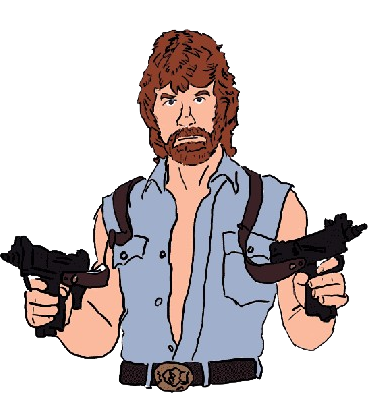

<!-- PROJECT LOGO -->
 

  

  <h3 align="center">Chuck Norris Facts Generator Website</h3>

  

    Hilarious Chuck Norris Facts to copy and paste !!!
     
    <a href="https://risshi.is-a.dev/chuck-norris-facts-generator/">View Live Demo</a>
  

<!-- ABOUT THE PROJECT -->
## About The Project

Chuck Norris Facts Generater uses the chucknorris api to generate an unlimited supply of Chuck Norris facts. CLick the button below , and save the ones you like !!!
Link to the awesome API used: https://github.com/chucknorris-io/chuck-api  

Chuck Norris facts are satirical factoids about martial artist and actor Chuck Norris that have become an Internet phenomenon and as a result have become widespread in popular culture. The 'facts' are normally absurd hyperbolic claims about Norris' toughness, attitude, virility, sophistication, and masculinity.

Chuck Norris facts have spread around the world, leading not only to translated versions, but also spawning localized versions mentioning country-specific advertisements and other Internet phenomena. Allusions are also sometimes made to his use of roundhouse kicks to perform seemingly any task, his large amount of body hair with specific regard to his beard, and his role in the action television series Walker, Texas Ranger
